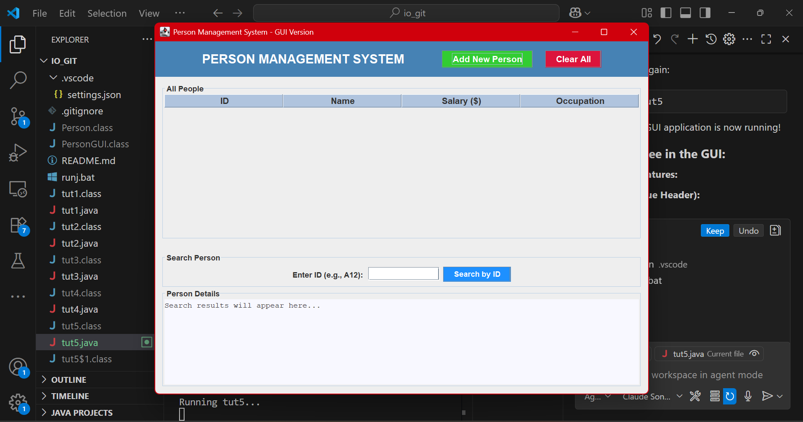

# Java Learning Repository

This project is my learning repository for Java programming, containing various tutorials and projects.

## Projects Overview

### tut1.java - Hello World
Basic Java program demonstrating simple output.

### tut2.java - User Input Program
Program that takes user input and displays personalized messages.

### tut3.java - Number Comparison
Program that compares two numbers and finds the smaller one.

### tut4.java - Console Person Management
Console-based person management system with array handling, data storage, and search functionality.

### tut5.java - GUI Person Management System
**GUI (Graphical User Interface)** version of the person management system using Java Swing.

#### What is GUI?
GUI stands for **Graphical User Interface** - a visual way for users to interact with programs using buttons, forms, tables, and windows instead of text commands.

#### How tut5.java Works:
- **Frontend Design**: Uses Java Swing components (JFrame, JTable, JButton, JDialog)
- **Data Management**: Stores person data with ID, name, salary, and occupation
- **Interactive Features**: 
  - Add new people through popup forms
  - Search by ID with instant results
  - View all data in a professional table
  - Clear all data with confirmation
- **Styling**: Color-coded buttons, formatted layouts, and user-friendly design

#### Key Components:
- **PersonGUI Class**: Data model for storing person information
- **Main Window**: Table view with search functionality
- **Dialog Forms**: Popup windows for adding new entries
- **Event Handling**: Button clicks and user interactions

---

*More projects and screenshots will be added as learning progresses...*
