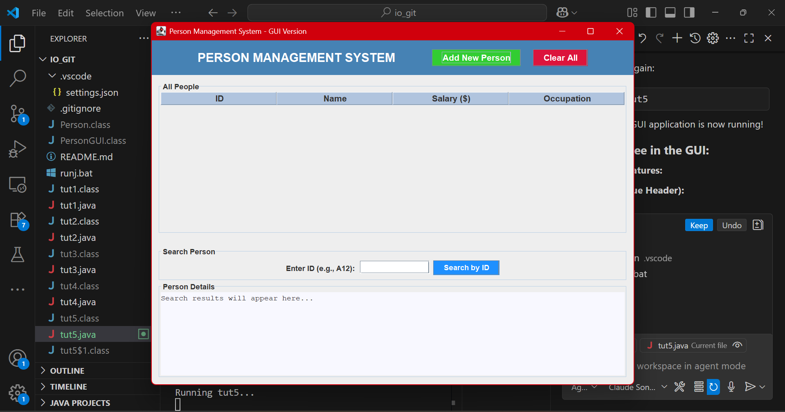
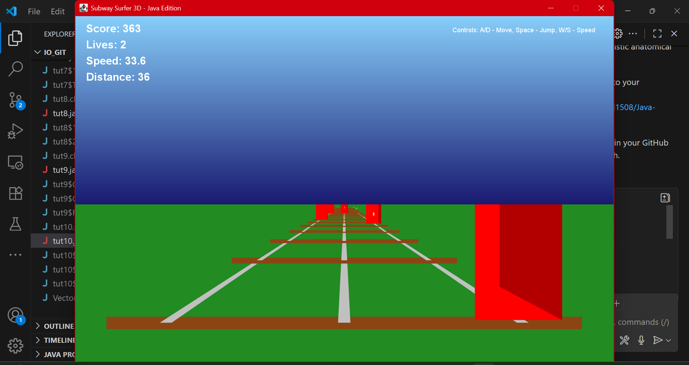
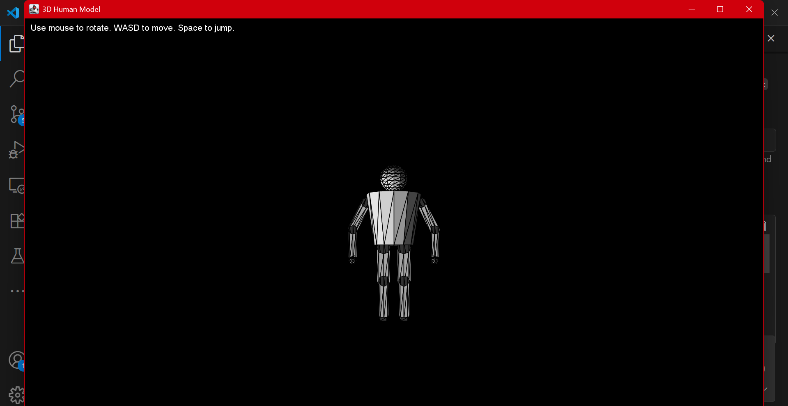

# Java Learning Repository

This project is my learning repository for Java programming, containing various tutorials and projects ranging from basic console applications to advanced 3D graphics.

## Projects Overview

### tut1.java - Hello World
Basic Java program demonstrating simple output.

### tut2.java - User Input Program
Program that takes user input and displays personalized messages.

### tut3.java - Number Comparison
Program that compares two numbers and finds the smaller one.

### tut4.java - Console Person Management
Console-based person management system with array handling, data storage, and search functionality.

### tut5.java - GUI Person Management System
**GUI (Graphical User Interface)** version of the person management system using Java Swing.



#### What is GUI?
GUI stands for **Graphical User Interface** - a visual way for users to interact with programs using buttons, forms, tables, and windows instead of text commands.

#### How tut5.java Works:
- **Frontend Design**: Uses Java Swing components (JFrame, JTable, JButton, JDialog)
- **Data Management**: Stores person data with ID, name, salary, and occupation
- **Interactive Features**: 
  - Add new people through popup forms
  - Search by ID with instant results
  - View all data in a professional table
  - Clear all data with confirmation
- **Styling**: Color-coded buttons, formatted layouts, and user-friendly design

#### Key Components:
- **PersonGUI Class**: Data model for storing person information
- **Main Window**: Table view with search functionality
- **Dialog Forms**: Popup windows for adding new entries
- **Event Handling**: Button clicks and user interactions

### tut6.java - Predator Game
A 2D game featuring a predator-prey simulation with:
- Random movement patterns
- Collision detection
- Green grass ground effects
- Timer-based game loop

### tut7.java - 3D Room Visualization
A 3D room visualization featuring:
- 3D perspective projection
- Table with realistic dimensions
- Sunlight effects
- Directional viewing controls

### tut8.java - Two-Story 3D House
Advanced 3D graphics demonstration including:
- Multi-level house structure
- Staircase implementation
- Movable characters
- Interactive camera controls

### tut9.java - Subway Surfer 3D
A fully functional Subway Surfer-style 3D game with advanced graphics and gameplay mechanics.



#### Features:
- **3D Graphics**: Full 3D perspective with depth sorting
- **Game Mechanics**: 
  - Three-lane running system
  - Jumping mechanics
  - Obstacle avoidance
  - Coin collection
  - Power-up system
- **Scoring System**: Points for distance and collectibles
- **Controls**: 
  - A/D or Left/Right arrows to move between lanes
  - Space to jump
  - W/S to control speed
- **Visual Effects**:
  - Dynamic lighting
  - Sky gradient
  - Ground texturing
  - Smooth animations

### tut10.java - 3D Human Model
Sophisticated 3D human model with anatomically correct proportions and animations.



#### Features:
- **Anatomical Accuracy**: 
  - Proportional body parts
  - Realistic joint movements
  - Detailed head, torso, limbs modeling
- **Interactive Controls**:
  - Mouse rotation for viewing angles
  - WASD movement
  - Walking animations
- **Technical Implementation**:
  - 3D mesh construction
  - Perspective projection
  - Lighting and shading
  - Real-time animation system

## Running the Programs

All programs can be executed using the `runj.bat` script:
```bash
.\runj.bat tutX
```
Replace X with the tutorial number you want to run (1-10).

## Development Tools
- Visual Studio Code with Red Hat Java Extension
- Java Development Kit (JDK)
- Git for version control

---

*Repository is actively maintained and updated with new Java learning projects.*
