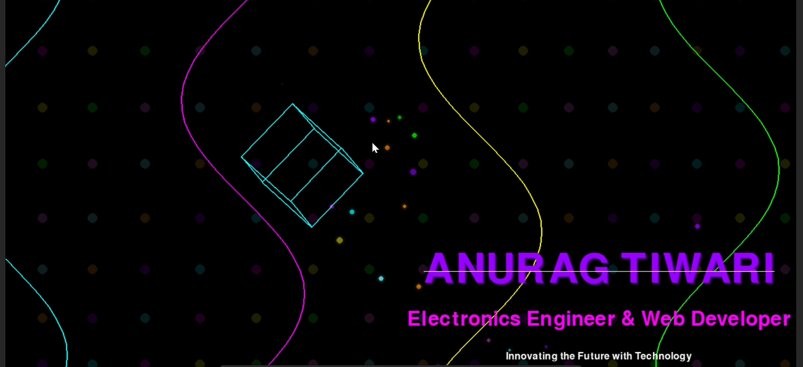

# Java Learning Repository

This project is my learning repository for Java programming and advanced graphics development, containing various tutorials and projects ranging from basic console applications to cutting-edge 3D graphics and interactive applications.

## 🌟 Featured Projects

### 🎯 Ultimate 3D Interactive Resume (Python)
A spectacular 3D resume application with holographic effects, particle physics, and interactive navigation.

### 🎮 Subway Surfer 3D Game (Java)
A fully functional 3D endless runner game with advanced graphics and gameplay mechanics.

### 👤 3D Human Model (Java)
Sophisticated anatomically accurate 3D human model with real-time animations.

### 💼 GUI Person Management System (Java)
Professional GUI application for managing person data with modern interface design.

## Projects Overview

### tut1.java - Hello World
Basic Java program demonstrating simple output.

### tut2.java - User Input Program
Program that takes user input and displays personalized messages.

### tut3.java - Number Comparison
Program that compares two numbers and finds the smaller one.

### tut4.java - Console Person Management
Console-based person management system with array handling, data storage, and search functionality.

### tut5.java - GUI Person Management System
**GUI (Graphical User Interface)** version of the person management system using Java Swing.


#### What is GUI?
GUI stands for **Graphical User Interface** - a visual way for users to interact with programs using buttons, forms, tables, and windows instead of text commands.

#### How tut5.java Works:
- **Frontend Design**: Uses Java Swing components (JFrame, JTable, JButton, JDialog)
- **Data Management**: Stores person data with ID, name, salary, and occupation
- **Interactive Features**: 
  - Add new people through popup forms
  - Search by ID with instant results
  - View all data in a professional table
  - Clear all data with confirmation
- **Styling**: Color-coded buttons, formatted layouts, and user-friendly design

#### Key Components:
- **PersonGUI Class**: Data model for storing person information
- **Main Window**: Table view with search functionality
- **Dialog Forms**: Popup windows for adding new entries
- **Event Handling**: Button clicks and user interactions

### tut6.java - Predator Game
A 2D game featuring a predator-prey simulation with:
- Random movement patterns
- Collision detection
- Green grass ground effects
- Timer-based game loop

### tut7.java - 3D Room Visualization
A 3D room visualization featuring:
- 3D perspective projection
- Table with realistic dimensions
- Sunlight effects
- Directional viewing controls

### tut8.java - Two-Story 3D House
Advanced 3D graphics demonstration including:
- Multi-level house structure
- Staircase implementation
- Movable characters
- Interactive camera controls

### tut9.java - Subway Surfer 3D
A fully functional Subway Surfer-style 3D game with advanced graphics and gameplay mechanics.


#### Features:
- **3D Graphics**: Full 3D perspective with depth sorting
- **Game Mechanics**: 
  - Three-lane running system
  - Jumping mechanics
  - Obstacle avoidance
  - Coin collection
  - Power-up system
- **Scoring System**: Points for distance and collectibles
- **Controls**: 
  - A/D or Left/Right arrows to move between lanes
  - Space to jump
  - W/S to control speed
- **Visual Effects**:
  - Dynamic lighting
  - Sky gradient
  - Ground texturing
  - Smooth animations

### tut10.java - 3D Human Model
Sophisticated 3D human model with anatomically correct proportions and animations.


#### Features:
- **Anatomical Accuracy**: 
  - Proportional body parts
  - Realistic joint movements
  - Detailed head, torso, limbs modeling
- **Interactive Controls**:
  - Mouse rotation for viewing angles
  - WASD movement
  - Walking animations
- **Technical Implementation**:
  - 3D mesh construction
  - Perspective projection
  - Lighting and shading
  - Real-time animation system

### anurag_resume_3d_fixed.py - Ultimate 3D Interactive Resume
A stunning 3D interactive resume application showcasing personal and professional information with cutting-edge graphics.



#### Features:
- **4K Ultra-HD Graphics**: Crystal clear, blur-free rendering
- **Holographic Text Effects**: Multi-layer glow and neon styling
- **Interactive Particle System**: Mouse-responsive particle physics
- **3D Geometric Objects**: Rotating cubes and pyramids with real-time 3D math
- **Quantum Background**: Flowing energy streams and dynamic patterns
- **Smooth Navigation**: 7 interactive sections with seamless transitions

#### Sections:
1. **HOME** - Animated title with tech symbols
2. **ABOUT** - Background and passion showcase
3. **SKILLS** - Interactive skill matrix with circular animations
4. **PROJECTS** - Featured projects with visual effects
5. **EXPERIENCE** - Professional journey timeline
6. **ACHIEVEMENTS** - Awards and recognitions
7. **CONTACT** - Contact information with style

#### Controls:
- **← → Arrow Keys** or **Mouse Clicks** to navigate sections
- **Mouse Movement** creates interactive particles
- **ESC** to exit fullscreen mode

#### Technical Implementation:
- **Pygame Graphics Engine**: Advanced 2D/3D rendering
- **Custom 3D Math**: Matrix transformations and perspective projection
- **Particle Physics**: Real-time particle simulation with gravity
- **Color Cycling**: Dynamic neon color schemes
- **60 FPS Animation**: Smooth real-time graphics

#### Quick Start:
```bash
# Easy launch with batch file
.\run_resume.bat

# Or direct Python command
.\anurag_resume_3d_fixed.py
```

## Running the Programs

### Java Programs
All Java programs can be executed using the `runj.bat` script:
```bash
.\runj.bat tutX
```
Replace X with the tutorial number you want to run (1-10).

### Python Programs
**3D Resume Application:**
```bash
# Quick launch
.\run_resume.bat

# Or PowerShell version
.\run_resume.ps1

# Direct command
& "C:/Users/Anurag Tiwari/OneDrive/Desktop/io_git/.venv/Scripts/python.exe" anurag_resume_3d_fixed.py
```

### Additional Files
- **AnuragResume3D.java** - Java Swing version of 3D resume
- **AnuragResume3DEnhanced.java** - Enhanced Java version with advanced graphics
- **run_resume.bat** - Simple launcher for Python 3D resume
- **run_resume.ps1** - PowerShell launcher script

## Development Tools
- Visual Studio Code with Red Hat Java Extension
- Java Development Kit (JDK)
- Git for version control

---

*Repository is actively maintained and updated with new Java learning projects.*
